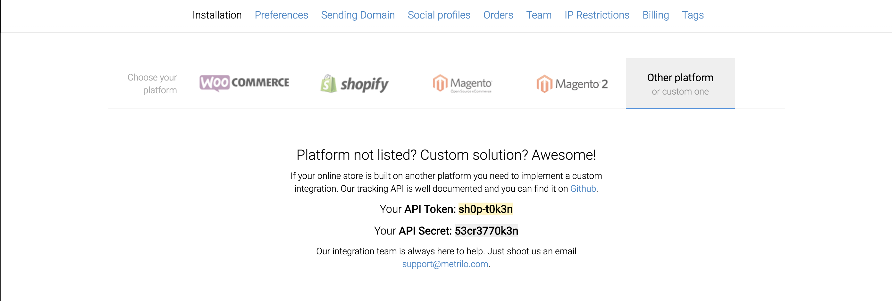

# Metrilo custom integration

:information_source: **This guide is intended to be used by developers.**

Metrilo helps you track the events that the people visiting your shop do - viewing specific pages or products, adding products to the cart, making orders, etc. The provided data is transformed into different reports and analytics metrics you could benefit from.

For more information about Metrilo and its features please visit [the official website](https://www.metrilo.com/).

## Overview

:warning: **We strongly recommend doing this on a Staging/Beta environment first to make sure the integration is smooth and nothing breaks down.**

- [Quickstart guide](#quickstart-guide)
- [API reference](#api-reference)
- [Importing resources](#importing-resources)
- [Managing resources](#creating-and-updating-resources)
- [Tracking library installation](#tracking-library-installation)
- [Tracking events](#tracking-events)
- [Form integration](#form-integration)

### Quickstart guide

:information_source: If you decide to follow along, you'll end up with some resources that you (most probably) won't use in the future. However, that's perfectly fine - after you're done testing, you can just ping us and we'll reset your project to a pristine state.

Once you've [signed up for a Metrilo account](https://app.metrilo.com/signup), navigate to the `Settings -> Installation` page in your [Metrilo project](https://app.metrilo.com) and keep your `API Token` handy - you'll need it for the rest of this tutorial:



Now you need to import your shop's resources into Metrilo - categories, products, customers, orders. Then you can start registering actions on them - views, adds to cart, new orders.

Let's create a category, a product and a customer. We'll assume
the current time (in milliseconds since 1970) is `1518004715732`:

```
curl -X POST "https://trk.mtrl.me/category" -i -H "Content-Type: text/plain" -d \
'{
  "time": 1518004715732,
  "token": "sh0p-t0k3n",
  "params": {
    "id": "1",
    "name": "Awesome clothing",
    "url": "https://my-awesome-shop.com/awesome-clothing"
  }
}'
```

```
curl -X POST "https://trk.mtrl.me/product" -i -H "Content-Type: text/plain" -d \
'{
  "time": 1518004715732,
  "token": "sh0p-t0k3n",
  "params": {
    "id": "2",
    "categories": ["1"],
    "price": 10.42,
    "name": "Awesome T-Shirt",
    "url": "https://my-awesome-shop.com/awesome-clothing/awesome-t-shirt"
  }
}'
```

```
curl -X POST "https://trk.mtrl.me/customer" -i -H "Content-Type: text/plain" -d \
'{
  "time": 1518004715732,
  "token": "sh0p-t0k3n",
  "params": {
    "email": "johnybravo@gmail.com",
    "createdAt": 1518004715732
  }
}'
```
(We include the `-i` param so that you can verify a 200 status code for all these requests)

(For all available properties for those resources, see the [managing resources](#creating-and-updating-resources) section and the [full API documentation](https://app.swaggerhub.com/apis/metrilo/api/1.0.0))

The next step is to install the frontend library. Add the following snippet to your website (preferably the `<head>` tag):

```
<script type="text/javascript" src="https://trk.mtrl.me/tracking.js?token=sh0p-t0k3n"></script>
```

When you load that script, you should have access to a `window.metrilo` object. That's what you're going to use to create tracking events on behalf of your customers.

Now let's create a user journey, calling the necessary frontend functions each step of the way:

- The customer `johnybravo@gmail.com` opens your homepage (but they are **not** logged in your website yet)
```javascript
window.metrilo.viewPage('http://my-awesome-shop.com/', { name: 'Awesome homepage' }) // This would be called on your homepage
```

- They navigate to the 'Awesome clothing' category (_category ID and all other IDs are from the shop's database and should be passed as strings_)
```javascript
window.metrilo.viewCategory('1') // This would be called on the 'Awesome clothing' category page
```

- They navigate to the 'Awesome T-shirt' product
```javascript
window.metrilo.viewProduct('2') // This would be called on the 'Awesome T-Shirt' product page
```

- They add one 'Awesome T-Shirt' to the cart
```javascript
window.metrilo.addToCart('2', 1) // This would be called when a user clicks an add to cart button
```

- They start checkout
```javascript
window.metrilo.checkout() // This would be called whenever the customer starts the checkout process
```

At that point, all of the actions are done by an anonymous user. In order to associate them with a customer in Metrilo you will need to obtain their email - by asking them to login, from your order details form, or any other form. When you do - call the [identify](#identify) function with their email. After the idenfity call, all past and future actions will be attributed to this customer.

```javascript
window.metrilo.identify('johnybravo@gmail.com') // This would be called whenever the customer provides their email address
```

- They submit the order

When they submit the order, you'll need to send the order event from your backend:

```
curl -X POST https://trk.mtrl.me/order" -i -H "Content-Type: text/plain" -d \
'{
  "time": 1518004715732,
  "token": "sh0p-t0k3n",
  "params": {
    "id": "314",
    "createdAt": "1518004715732",
    "email": "johnybravo@gmail.com",
    "amount": "10.42",
    "status": "completed",
    "products": [
      {
        "productId": "2",
        "quantity": 1
      }
    ]
  }
}'
```

And that's it! Now when all events are processed by Metrilo, they will be attributed to the `johnybravo@gmail.com` user. You can check that out in the `Customer Database` tab in your [Metrilo project](https://app.metrilo.com).

:information_source: Please allow for up to several minutes for all events to be processed.

:information_source: If all backend calls return 200 and you're missing events - double check your input data.

## API reference

Our API documentation is written according to the [OpenAPI Specification](https://swagger.io/docs/specification/about/). You can find all of the endpoints the Metrilo API serves and what parameters they require [here](https://app.swaggerhub.com/apis/metrilo/api/1.0.0).

:information_source: The base url for each request is `https://trk.mtrl.me`. Don't forget that you need to add your Metrilo `API token` as a `token` parameter in the request body.

### Creating and updating resources

A _resource_ is a **category**, **product**, **customer** or **order**. Any time one of these changes on your backend, you should call the respective endpoint to create or update the resource in Metrilo. You can find more details for each endpoint in the [documentation](https://app.swaggerhub.com/apis/metrilo/api/1.0.0).

| Endpoint           | Usage                               |
| :----------------- | :---------------------------------- |
| /customer          | Create or update a single customer  |
| /category          | Create or update a single category  |
| /product           | Create or update a single product   |
| /order             | Create or update a single order     |

All calls to these endpoints have to be done from your backend - therefore, we don't provide any specific code examples as the implementation is bound to your backend logic and programming language.

:information_source: Each Metrilo project has its own `API Token` and multiple stores cannot point to the same Metrilo project.

:information_source: Most of the time the data you send will override any existing data. For example, if you make a call about product *A* with categories *C1* and *C2* and then you make another call only with category *C3*, then the first two categories will be removed from the product. However, sometimes the data will be merged (e.g. adding a product's options). If the data is merged, it will be explicitly mentioned in the documentation.

:information_source: Note that each request you send to Metrilo is limited to **5MB** in size.

### Importing resources

Before sending any [tracking events](#tracking-events) to Metrilo, you need to import your data using the endpoints provided for each resource. **Note that importing must be done in the order provided.** You can find more details for each endpoint in the [documentation](https://app.swaggerhub.com/apis/metrilo/api/1.0.0).

| #  | Resource         | Endpoint          | Required |
| :- | :--------------- | :---------------- | :------- |
| 1. | Customers        | `/customer/batch` | Yes      |
| 2. | Categories       | `/category/batch` | Yes      |
| 3. | Deleted products | `/product/batch`  | Only if you want to import orders for products that no longer exist in your database   |
| 4. | Products         | `/product/batch`  | Yes      |
| 5. | Orders           | `/order/batch`    | Only if you want to sync any historical data with Metrilo     |

:warning: The order stated above is important, because orders are dependent on customers and products (which are in turn dependent on categories). An order won't be imported if Metrilo doesn't know about the customer or the product.

### Tracking library installation

Insert the following script tag in the page you want to track (we recommend inserting it in the `<head>` tag):
```
<script type="text/javascript" src="https://trk.mtrl.me/tracking.js?token=<YOUR_PROJECT_TOKEN>"></script>
```

Replace `<YOUR_PROJECT_TOKEN>` with the API token from within the `Settings -> Installation` page in your Metrilo project.

:information_source: Make sure to remove the `<` and `>` symbols. So, for instance, if your token was `1234asdf`, you would need to put in this snippet:
```
<script type="text/javascript" src="https://trk.mtrl.me/tracking.js?token=1234asdf"></script>
```

When you have successfully loaded the tracking library, you will have access to a `window.metrilo` object on your page.

:information_source: **You should add the script tag on every page that you want to track!**

### Tracking events

A tracking event is an action that a customer of yours does on your website - such as viewing a page, adding an item to their cart, ordering a product, etc. These actions are saved in the customer's current session and are the base of which Metrilo does its magic.

These are the functions you need to call on the `window.metrilo` object based on what a customer does on your website.

| Whenever a customer                 | you need to call                   |
| :---------------------------------- | :--------------------------------- |
| enters their email on your website  | [identify](#identify)              |
| enters their details on your website| [customerDetails](#customerDetails)|
| visits a page                       | [viewPage](#viewPage)              |
| visits an article page              | [viewArticle](#viewArticle)        |
| visits a category page              | [viewCategory](#viewCategory)      |
| visits a product page               | [viewProduct](#viewProduct)        |
| types something in the search bar   | [search](#search)                  |
| adds a product to their cart        | [addToCart](#addToCart)            |
| removes a product from their cart   | [removeFromCart](#removeFromCart)  |
| visits the checkout page            | [checkout](#checkout)              |
| does anything you'd like to tag     | [applyTags](#applyTags)            |
| does anything                       | [customEvent](#customEvent)        |

:warning: It is extremely important _not_ to cache any customer-action-specific calls. This will result in events being attributed to the wrong customer, which cannot be undone. If you are using full page caching, consider adding some sort of hole-punching mechanism.

:information_source: Processing the calls to our API does not happen instantly - please allow for about a minute for them to be processed.

:information_source: Keep in mind that if you try to send any tracking event for a resource that doesn't exist in Metrilo, your request won't be processed.

#### Identify

When a customer comes to the store and they are not logged in, Metrilo treats them as an anonymous customer by adding a unique identifier to their session (a cookie named **cbuid**), so that it could attribute their actions to this identifier. Once they provide an email (by logging in, signing up, filling in a subscription form, making an order, etc.) you need to call the identify function. This will associate the unique identifier with the email and all events that the customer had while being anonymous will be merged with the events they have as identified (if any).

It is enough to call `identify` only once - the first time the customer enters their email. If you are unsure whether you have already called it - just check the value of the **cbuid** cookie. If there is an email - no need to call it. Otherwise it will contain the unique identifier mentioned above.

:information_source: Sometimes customers will log out, use different devices, browsers or delete their cookies. Every time that happens Metrilo will create a new anonymous customer with a new unique identifier. However, once the customer identifies themselves (enters their email and you call metrilo.identify) Metrilo will check for the existence of a customer with the entered email and if there is one, it will merge them with the anonymous customer.

```javascript
  const email = 'johnnybravo@gmail.com' // Customer's email address

  window.metrilo.identify(email)
```

#### customerDetails

Customer has entered their details on a web form. This call updates the first name, last name and subscribed status of an existing customer.

```javascript
  const params = {
    firstName: 'Johny', // Customer's first name (optional)
    lastName: 'Bravo', // Customer's last name (optional)
    subscribed: false // Subscribed status - true or false (optional)
  }

  window.metrilo.customerDetails(params)
```

#### viewPage

Customer has visited a page on your website. It can be the homepage, or any other page.

```javascript
  const url = 'http://myshop.com/amazing-page' // Absolute URL to the visited page
  const params = {
    name: 'My Amazing page' // The name of the page in the shop
  }

  window.metrilo.viewPage(url, params)
```

#### viewArticle

Customer has visited an article page.

```javascript
  const articleId = '42' // Unique ID of article resource in the shop's database
  const params = {
    name: 'How to increase sales' // Article display name in the shop
    url: 'http://myshop.com/how-to-increase-sales' // Landing page for the article resource
  }

  window.metrilo.viewArticle(articleId, params)
```

#### viewCategory
Customer has visited a category page.

```javascript
  const categoryId = '9912' // Unique ID of category resource in the shop's database

  window.metrilo.viewCategory(categoryId)
```

#### viewProduct
Customer has visited a product page.

```javascript
  const productId = '312' // The ID of the product in the shop's database

  window.metrilo.viewProduct(productId)
```

#### search

Customer has searched in the shop (this supports only a plain query string without further filtering).

```javascript
  const query = 'a plant' // Search query string that the visitor entered in the search form
  const url = 'http://myshop.com/search/?s=a+plant' // The URL that the visitor landed on when submitting the search form

  window.metrilo.search(query, url)
```

#### addToCart
Customer has added a product to the cart.

```javascript
  const productId = '312' // The ID of the added product
  const quantity = 2 // The quantity of added items

  window.metrilo.addToCart(productId, quantity)
```

#### removeFromCart
Customer has removed a product from the cart.

```javascript
  const productId = '312' // The ID of the removed product
  const quantity = 1 // The quantity of removed items

  window.metrilo.removeFromCart(productId, quantity)
```

#### checkout
Customer has started the checkout process.

```javascript
  window.metrilo.checkout()
```

#### applyTags
Adds tags to a customer.

```javascript
  const tags = ['regular', 'big_spender'] // Tag labels that are assigned to the customer in the Metrilo application

  window.metrilo.applyTags(tags)
```

#### customEvent
Sends a custom event (anything you want to track).

```javascript
  const customEventName = 'paypal_payment' // The name of the custom event

  window.metrilo.customEvent(customEventName)
```

### Form integration

You can integrate a form (such as a newsletter subscription form) with Metrilo using the function below, that will also create all necessary Metrilo events for you when the form is submitted:
```javascript
  window.metrilo.integrateForm({
    formSelector: '#newsletter-form', // required - a regular css selector for the form
    email: 'newsletter[fields][1]', // required - the name attribute of the "email" input field
    firstName: 'newsletter[fields][0][first]', // optional - the name attribute of the "first name" input field
    lastName: 'newsletter[fields][0][last]', // optional - the name attribute of the "last name" input field
    subscribed: 'newsletter[fields][2][]', // optional - the name attribute of the "subscribed"  checkbox
    tags: ['newsletter-subscriber'], // optional - an array of tags to be applied
    customEvent: 'newsletter-subscribed' // optional - a custom event to be sent
  });
```

:information_source: If you're loading the main Metrilo script asynchronously, you can use the `window.metriloQueue` object to defer functions until Metrilo is loaded. For example:
```javascript
  (function() {
    const f = function () {
        window.metrilo.integrateForm({
          formSelector: '#newsletter-form',
          email: 'newsletter[fields][1]'
        });
    };
    if ((typeof window.metrilo === 'undefined') || (typeof window.metrilo.integrateForm === 'undefined')) {
      window.metriloQueue = window.metriloQueue || [];
      window.metriloQueue.push(f);
    }
    else {
      f();
    }
  })();
```

## Troubleshooting

### Error codes

The following error codes are valid for all endpoints:

| Code | Message                                       |
| :--- | :-------------------------------------------- |
| 200  | Success response.                             |
| 400  | Bad request from client.                      |
| 401  | Project token is invalid.                     |
| 402  | Project requires payment.                     |
| 403  | The IP that the request came from is ignored. |
| 500  | Error from server while processing request.   |
| 502  | Error from server accepting request.          |
